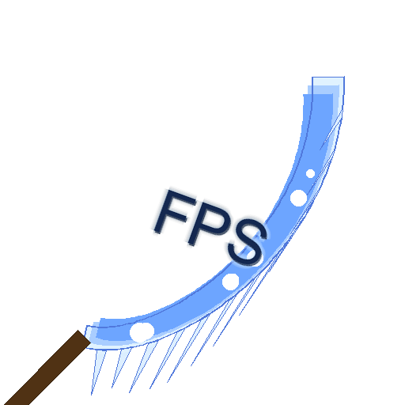

# FPSickle

<p align="center">
  
</p>

A tool for analyzing raw video game recordings from OBS and estimating their real framerate. The tool generates a framerate graph overlay on top of the video.

## Features

- Analyzes raw AVI recordings from OBS
- Detects actual framerate by analyzing frame differences
- Generates a framerate graph overlay
- Supports saving the analysis as a video file

## Requirements

- Python 3.8+
- Dependencies listed in requirements.txt

## Installation

1. Clone this repository
2. Install the required dependencies:
   ```
   pip install -r requirements.txt
   ```

## Example Usage

To run FPSickle on a sample AVI file:

```bash
python src/fpsickle.py -i path/to/your/recording.avi -o analyzed_output.mp4
```

## Getting Test Files

Since OBS recordings can be large, you'll need to create your own test files. Here's how to capture a short game recording with OBS:

1. Install OBS Studio from [obsproject.com](https://obsproject.com/)
2. Set up OBS to record your game:
   - Add a "Game Capture" source
   - In Settings → Output, set the Recording Quality to "Lossless Quality, Tremendously Large File Size"
   - Make sure "Simple" Output Mode is selected
3. Record a short gameplay clip (30 seconds is usually enough for testing)

## Expected Results

After analyzing a video, you'll get:

- A video file with the FPS graph overlay
- Console output with the average, minimum, and maximum FPS values
- A real-time display of the video during analysis (unless `--no-display` is used)

### Options:
FPSickle can be tuned using these parameters:

- `--input` / `-i`: Path to input AVI file
- `--output` / `-o`: Path to output video file
- `--no-display`: Don't display video during processing

# Advanced Options
Optionally you can use the following flags to change the behavior of the tool:

- `--window` / `-w`: Analysis window size in frames (default: 30)  Smaller values give more frequent updates but may be less accurate
- `--threshold` / `-t`: Frame difference threshold (default: 0.001) Lower values are more sensitive to small changes between frames
- `--codec` / `-c`: FourCC codec for output video (default: mp4v) (see codec options below)

## Troubleshooting

### Output Video Issues

If you encounter problems with the output video, try specifying a different codec with the `-c` flag:

```
python src/fpsickle.py -i input.avi -o output.mp4 -c avc1
```

Common codec options:

- `mp4v`: Default MP4 codec
- `avc1`: H.264 codec
- `xvid`: Xvid codec
- `mjpg`: Motion JPEG codec

### Performance Issues

If the analyzer is running too slowly:

- Use the `--no-display` flag to disable video preview
- Try processing a shorter clip
- Increase the threshold value to reduce sensitivity

### Common Errors

- **"Only AVI files are supported"**: The tool currently only supports AVI files from OBS
- **"Error calculating frame difference"**: This may occur if frames have inconsistent dimensions
- **"No FPS data was collected"**: Try decreasing the threshold value for more sensitivity

## How It Works

FPSickle works by comparing consecutive frames to detect when a new frame is actually displayed.
In many game recordings, the actual framerate differs from the recording framerate due to:

1. Variable refresh rate of the game
2. Recording software capturing at a fixed rate
3. Duplicated frames in the recording

This tool uses image processing techniques to identify unique frames and calculate the true framerate over time.
